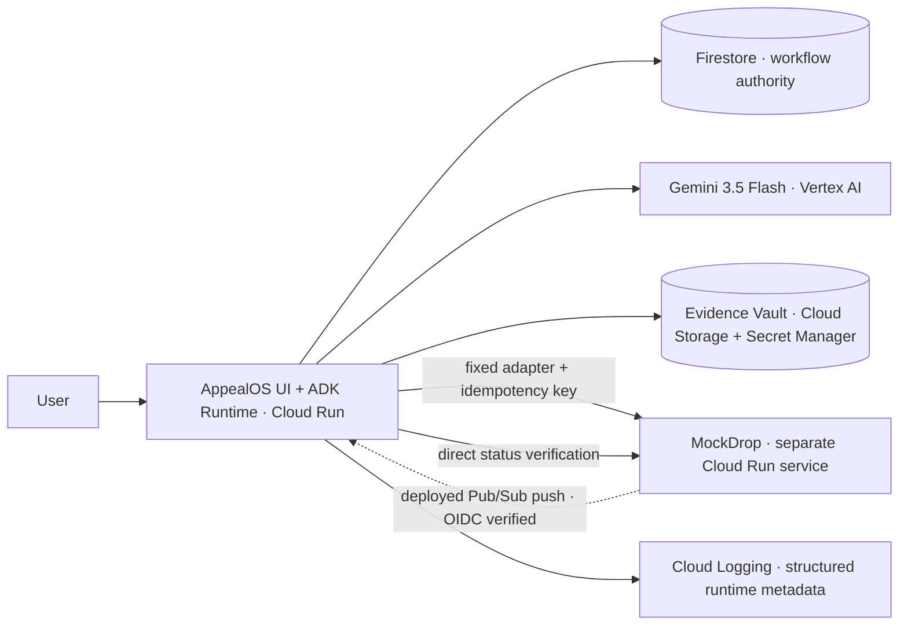

# AppealOS Runtime

[](https://github.com/rectinajh/AppealOS/actions/workflows/ci.yml)

> Platforms already use algorithms to judge us. Ordinary people need a tireless digital advocate of their own.

**AppealOS is a user-owned appeal workflow runtime for an algorithmic world.** It turns a platform suspension notice, user-directed evidence, policy rules, deadlines, and scoped authorization into an executable `AppealCase`. After one bounded approval, the Agent submits the appeal, handles one authorized evidence request, tracks the response, and verifies the final account state.


## Live demo

- Case workspace: https://appealos-606769518273.us-central1.run.app
- Verified flow: `Reset → Parse notice → Consent → Mandate → Submit → Supplement → Verify`, ending in `ACCOUNT_ACTIVE`.
- Live backend check: `GET /health` returns `storeBackend: firestore`, `evidenceVaultBackend: gcs`, `pubsubOidcVerification: true`, and `revision: appealos-00008-cf6`; the case timeline is hash-chained and returns `verified: true`.

## Project status

**Rescue slice live on Google Cloud; Pub/Sub/OIDC and Evidence Vault deployed and verified.** The live revisions (`appealos-00008-cf6`, `mockdrop-00004-6xh`) prove real Gemini 3.5 Flash calls through Google ADK, two Cloud Run services, Firestore persistence, typed MockDrop writes, strict artifact/destination/expiry checks, case recovery by ID, an OIDC-verified Pub/Sub push route, a hash-chained timeline, and one approved execution call that returns `ACCOUNT_ACTIVE`. The Evidence Vault stores AES-256-GCM ciphertext in Cloud Storage, reads the demo AES key from Secret Manager, and quarantines tampered evidence before citation/disclosure.

Nothing in this repository should be read as a claim of a live DoorDash, Uber, TikTok, Amazon, GitHub, or other platform integration. The MVP uses synthetic data and a fictional delivery-platform simulation called **MockDrop**.

## Background

More of our income, audience, and access now depends on platforms we do not control. Delivery riders, marketplace sellers, creators, and developers are routinely judged by automated systems: a fraud signal, an identity check, an unexplained complaint, or a moderation decision can suspend an account within minutes. The decision is automated, but the recovery process is not.

This asymmetry is already visible in public evidence:

- The [Seattle App-Based Worker Deactivation Rights Ordinance](https://www.seattle.gov/laborstandards/ordinances/app-based-worker-ordinances/app-based-worker-deactivation-rights-ordinance) recognizes that algorithmic deactivation needs due process.
- [Human Rights Watch documented in *The Gig Trap*](https://www.hrw.org/report/2025/05/12/the-gig-trap/algorithmic-wage-and-labor-exploitation-in-platform-work-in-the-us) how algorithmic wage and labor controls create real economic harm for platform workers.

## Why AppealOS exists

The problem is not just a bad form. It is a structural asymmetry: the platform owns the decision pipeline, the dashboards, the data, and the process, while the affected person gets a short notice and a contextless appeal box. The person is expected to reconstruct the allegation, gather evidence, learn the policy, meet the deadline, and follow up — often while their income is already gone.

AppealOS exists to give ordinary people a durable, tireless digital advocate of their own: a user-owned workflow that remembers the case, stays within explicit permissions, keeps moving after approval, and only declares success after the external account state is directly verified.

## The problem it solves

A delivery rider, seller, creator, or developer can lose an account, income, audience, or funds because of an automated decision. The information needed to respond — the allegation, evidence, policy rules, deadlines, receipts, GPS traces, and device logs — is fragmented across email, help pages, and account history. The missing product is not a better appeal-letter generator; it is a persistent workflow that carries one case from notice to a verified outcome.

## How it solves it

AppealOS joins the suspension notice, user-directed evidence, policy rules, deadlines, and scoped authorization into an executable `AppealCase`. After one bounded approval, the Agent follows a persistent workflow that can:

1. read the platform notice;
2. identify the allegation and deadline;
3. inspect only user-approved evidence;
4. reconstruct a citation-backed fact timeline;
5. compare the facts with a versioned policy profile;
6. compile grounded claim units;
7. obtain a scoped `AppealMandate`;
8. submit through a typed platform adapter;
9. react to an asynchronous supplement request delivered through deployed Pub/Sub;
10. verify a clear result: restored, rejected, or human escalation.

## The 48-hour proof

The hackathon scope is deliberately narrow:

- one fictional delivery platform: MockDrop;
- one suspension reason: abnormal location;
- exactly three evidence artifacts: one delivery receipt, one GPS trace, and one device log;
- one frozen policy profile;
- one initial appeal submission;
- one supplement request returned by MockDrop and delivered through a deployed, OIDC-verified Pub/Sub push consumer;
- one authorized supplement;
- one verified account transition from `SUSPENDED` to `ACTIVE`;
- one in-memory synthetic evidence fixture set with hashes (not an encrypted Vault);
- one complete, hash-chained Agent action timeline.

The deterministic demo reveals that a cellular-network handoff was mistaken for location fraud. AppealOS submits the case, receives a request for the device log, supplies it within the user's mandate, then calls MockDrop's account-status endpoint separately before declaring success.

## Implemented now

The current slice proves the external platform state machine locally and on Cloud Run:

```text
SUSPENDED
→ SUPPLEMENT_REQUESTED
→ APPROVED
→ ACTIVE
```

MockDrop currently provides:

- reset, account, appeal, supplement, decision, and receipt-recovery APIs;
- stable request and response hashes;
- idempotent replay for initial appeals and supplements;
- conflict detection when one idempotency key is reused with a different body;
- valid-device-log and rejected-evidence paths;
- an optional local bearer-token guard for write routes;
- an env-gated Pub/Sub publisher for `SUPPLEMENT_REQUESTED` and decision events (`MOCKDROP_PUBSUB_ENABLED=true`);
- eight HTTP integration tests using Node's built-in test runner.

AppealOS currently provides:

- a FastAPI service with real Google ADK `LlmAgent` runners (`google-adk==2.8.0`);
- real Vertex AI calls to `gemini-3.5-flash` at the `global` endpoint;
- deterministic notice validation, citation validation, mandate scope, supplement-cycle guard, and direct account-state verification;
- a durable case store with an in-memory fallback and a verified Firestore backend (`app/store.py`);
- a Pub/Sub push endpoint `/events/pubsub` that consumes supplement events idempotently and still verifies `ACTIVE` directly;
- a typed HTTP adapter to MockDrop;
- a post-approval `/demo/run` execution that performs submit → supplement → verify and returns `ACCOUNT_ACTIVE` without fabricating user consent;
- strict consent/mandate checks for expiry, adapter, account, action, artifact, supplement template, and cycle count;
- case reload by ID and a hash-chain verification endpoint for the action timeline;
- a synthetic Evidence Vault backed by Cloud Storage and Secret Manager, with plaintext/ciphertext hash and AAD verification before evidence citation or disclosure;
- 37 Python tests covering authorization, recovery, concurrent delivery, autonomous execution, Pub/Sub behavior, endpoint evidence, Evidence Vault verification, and tamper quarantine.

Deployed Cloud Run URLs:

- MockDrop (`mockdrop-00004-6xh`): https://mockdrop-606769518273.us-central1.run.app
- AppealOS (`appealos-00008-cf6`): https://appealos-606769518273.us-central1.run.app

Deployment logs, reproducible commands, and runtime evidence: [docs/DEPLOYMENT.md](docs/DEPLOYMENT.md).

## Spin-up

### MockDrop

Prerequisites: Node.js >= 22.

```bash
npm install
npm run check
npm test
npm run start:mockdrop
```

`npm run check` runs the MockDrop workspace check, `npm test` runs the eight HTTP integration tests, and `npm run start:mockdrop` starts the local MockDrop API. See [apps/mockdrop/README.md](apps/mockdrop/README.md) for the current API contract and available routes.

### AppealOS

Prerequisites: Python 3.12+ and `gcloud` authenticated to a project with Vertex AI enabled.

```bash
cd apps/appealos
python3 -m venv .venv
source .venv/bin/activate
pip install -r requirements.txt
export MOCKDROP_BASE_URL=https://mockdrop-606769518273.us-central1.run.app
# Durable storage: firestore uses GOOGLE_CLOUD_PROJECT; memory is the local default.
export APPEALOS_STORE_BACKEND=firestore
export GOOGLE_CLOUD_PROJECT=boxwood-scope-364905
# Evidence Vault: memory fallback by default; gcs reads Cloud Storage + Secret Manager.
export APPEALOS_EVIDENCE_BACKEND=gcs
export APPEALOS_EVIDENCE_BUCKET=appealos-evidence-vault
export APPEALOS_EVIDENCE_KEY_SECRET=appealos-demo-evidence-key
python -m uvicorn app.main:app --host 0.0.0.0 --port 8080
```

Use the web workspace for the full demo. It deliberately requires separate human consent and mandate approval; `/demo/run` only executes an already-approved case and never auto-approves on the user's behalf. Expected final state after the approved execution: `ACCOUNT_ACTIVE`. The exact endpoint contract is documented in [apps/appealos/README.md](apps/appealos/README.md).

### Redeploy

The exact `gcloud run deploy` commands for both services are recorded in [docs/DEPLOYMENT.md](docs/DEPLOYMENT.md).

## Why it is agentic

AppealOS is not organized around a chat box. Its value comes from durable state and external action:

- **Background execution:** the case continues after approval without repeated prompts.
- **Tool use:** ADK agents interpret notices and draft grounded claims; deterministic adapters perform MockDrop writes, mandate guards, and status verification.
- **Memory:** Firestore is the durable authority for the case, mandate, receipts, and event history.
- **Scoped autonomy:** an `AppealMandate` limits destination, evidence, actions, supplement count, and expiry.
- **Verifiable progress:** `SUBMITTED`, `ACKNOWLEDGED`, `APPROVED`, and `ACCOUNT_ACTIVE` are different events.
- **Failure honesty:** rejection and human escalation are valid outcomes; the product never promises reinstatement.

## User control model

AppealOS separates internal analysis from external action.

| Permission | What it allows | What it does not allow |
|---|---|---|
| `AnalysisConsent` | Process selected synthetic artifacts to build the timeline and draft claims | Disclose evidence or contact a platform |
| `AppealMandate` | Send named claims and evidence to one adapter, handle one allowed supplement, poll, and verify | Contact a new recipient, add a new claim, or disclose a new evidence class |

The MVP uses one-hour consent and mandate expiry plus a one-cycle supplement limit. A revocation endpoint is not implemented; the UI and submission do not claim otherwise.

## Implemented and optional Google Cloud architecture



The synchronous demo can use the supplement request in MockDrop's typed response. The deployed path also publishes that request to `mockdrop-platform-events`, delivers it to `POST /events/pubsub` with OIDC verification, and deduplicates it in Firestore before taking the authorized supplement action.

## Gemini, ADK, and deterministic code

Gemini is used for structured notice extraction, evidence relevance, and grounded claim drafting. Google ADK supplies the real `LlmAgent` runners and structured output schemas. Deterministic Python — not an unverified model callback — owns authorization and every external write.

The model is not allowed to authorize actions or write case state. Deterministic code controls:

- deadlines and state transitions;
- citation-integrity checks;
- mandate scope and expiry;
- evidence-field and byte limits;
- adapter destinations;
- idempotency and event deduplication;
- final external account-state verification.

The first deployment smoke test recorded:

- Gemini model ID: `gemini-3.5-flash`
- Backend: Vertex AI, `global` endpoint
- Google ADK version: `google-adk==2.8.0`

An older model is not an acceptable fallback.

## Documentation

- [Product Requirements Document](docs/PRD.md): users, scope, requirements, acceptance criteria, and release gates.
- [Technical Design](docs/TECHNICAL_DESIGN.md): architecture, contracts, data model, state machine, security, and delivery plan.
- [Deployment evidence](docs/DEPLOYMENT.md): live Cloud Run URLs, commands, logs, and planned-vs-implemented notes.

The approved interaction sketch is included below.


## Submission / Devpost

The Devpost submission draft — bilingual text for every required field, a submission checklist, link summary, and engineer/designer backfill placeholders — lives in [SUBMISSION.md](SUBMISSION.md).

- Primary track: **The Taskmaster**.
- `Technologies used` must name **Gemini 3.5+**, **Google ADK**, and **Cloud Run**; MockDrop is a synthetic simulation platform.
- Deployed origin URLs: https://appealos-606769518273.us-central1.run.app and https://mockdrop-606769518273.us-central1.run.app. Exact model/framework versions are in [docs/DEPLOYMENT.md](docs/DEPLOYMENT.md).
- If this section conflicts with another README edit, `SUBMISSION.md` is authoritative for Devpost facts.

Supporting deliverables: [demo script outline](docs/DEMO_SCRIPT.md) and [bonus social posts](docs/SOCIAL_POSTS.md).

## Submission assets

Devpost visual and demo deliverables live in [`submission/`](submission/):

- [Storyboard + narration script](submission/STORYBOARD.md)
- [Demo video, 1280×720 MP4, 3:58](submission/demo-video.mp4) — English narration with burned-in English subtitles
- [English subtitles](submission/demo-subtitles-en.srt) and [Simplified Chinese subtitles](submission/demo-subtitles-zh.srt)
- [Devpost 16:9 cover, 1920×1080](submission/devpost-cover-1920x1080.png)
- The Mermaid architecture in this README is authoritative; legacy rendered assets are not submission-ready until regenerated from it.
- UI/flow screenshots in [`submission/screenshots/`](submission/screenshots/)
- [Local MockDrop API transcript](submission/mockdrop-api-transcript.txt)

The GCP running-evidence segment now has live `.run.app` URLs, Cloud Run deploy logs, and Vertex AI/ADK runtime log excerpts in [docs/DEPLOYMENT.md](docs/DEPLOYMENT.md).

## Planned repository shape

```text
.
├── README.md
├── docs/
│   ├── PRD.md
│   ├── TECHNICAL_DESIGN.md
│   └── assets/
├── apps/
│   ├── appealos/       # implemented FastAPI + ADK rescue runtime
│   └── mockdrop/       # implemented fictional platform API
├── fixtures/           # proposed synthetic notice, policy, and evidence
└── tests/              # proposed state, mandate, adapter, and security tests
```

`apps/mockdrop` and `apps/appealos` exist today. Firestore persistence, case recovery, the OIDC-verified Pub/Sub consumer route, strict mandate enforcement, the Evidence Vault, and the single-page workspace are implemented and deployed. Real-platform adapters remain out of scope.

## Safety boundaries

- Synthetic fixtures only in the public MVP.
- No legal advice or guaranteed outcome.
- No fabricated or silently modified evidence.
- Platform content is untrusted data, never Agent instructions.
- No arbitrary URL, shell, email, browser, or filesystem tool.
- No real-platform automation without terms, privacy, security, and jurisdiction review.
- “Digital public defender” and “due process” describe the mission, not a legal service.

## Sources informing the problem

- [All Things Agentic Hackathon official rules](https://allthingsagentichackathon.devpost.com/rules)
- [Seattle App-Based Worker Deactivation Rights Ordinance](https://www.seattle.gov/laborstandards/ordinances/app-based-worker-ordinances/app-based-worker-deactivation-rights-ordinance)
- [Seattle Office of Labor Standards deactivation intake](https://laborinquiry.seattle.gov/deactivation/)
- [DoorDash deactivation appeal guide](https://help.doordash.com/en-us/dashers/article/how-to-appeal-dasher-account-deactivations?ctry=us&divcode=tx)
- [Human Rights Watch: The Gig Trap](https://www.hrw.org/report/2025/05/12/the-gig-trap/algorithmic-wage-and-labor-exploitation-in-platform-work-in-the-us)
- [Google Cloud: Host AI agents on Cloud Run](https://docs.cloud.google.com/run/docs/ai-agents)
- [Google Cloud: Deploy an ADK agent to Cloud Run](https://docs.cloud.google.com/run/docs/ai/build-and-deploy-ai-agents/deploy-adk-agent)

## License and contributions

MIT © 2026 AppealOS Contributors. See [LICENSE](LICENSE).

Contribution guidance will be added after the first working demo.
