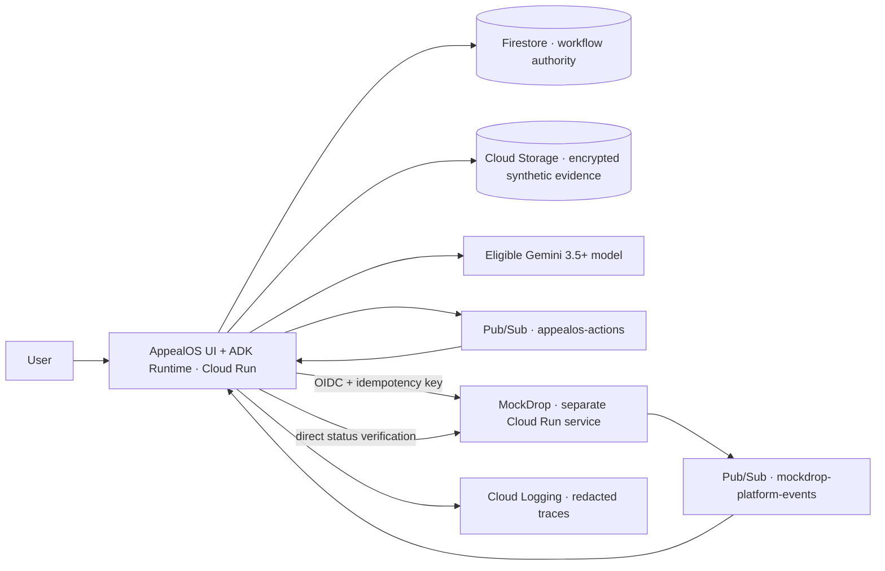
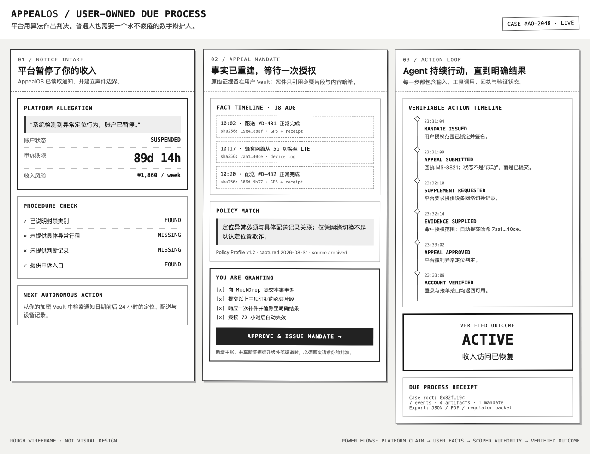

# AppealOS Runtime

> Platforms already use algorithms to judge us. Ordinary people need a tireless digital advocate of their own.

**AppealOS is a user-owned appeal workflow runtime for an algorithmic world.** It turns a platform suspension notice, user-directed evidence, policy rules, deadlines, and scoped authorization into an executable `AppealCase`. After one bounded approval, the Agent submits the appeal, handles one authorized evidence request, tracks the response, and verifies the final account state.

> 项目宣言：平台已经用算法审判我们。现在，普通人也需要一个永不疲倦的数字辩护人。

## Project status

**Rescue slice live on Google Cloud.** MockDrop and the AppealOS ADK rescue runtime are both deployed to Cloud Run and verified end-to-end. The demo reaches `ACCOUNT_ACTIVE` through the required `reset → notice → consent → mandate → submit → supplement → verify` path. Firestore persistence, Pub/Sub event delivery, the Evidence Vault, and the UI remain planned.

Nothing in this repository should be read as a claim of a live DoorDash, Uber, TikTok, Amazon, GitHub, or other platform integration. The MVP uses synthetic data and a fictional delivery-platform simulation called **MockDrop**.

## The problem

A delivery rider, seller, creator, or developer can lose an account, income, audience, or funds because of an automated fraud signal, identity failure, unexplained complaint, or moderation mistake. The person is then expected to reconstruct the allegation, evidence, policy, deadline, and follow-up process through a contextless form.

The missing product is not a better appeal-letter generator. It is a persistent workflow that can:

1. read the platform notice;
2. identify the allegation and deadline;
3. inspect only user-approved evidence;
4. reconstruct a citation-backed fact timeline;
5. compare the facts with a versioned policy profile;
6. compile grounded claim units;
7. obtain a scoped `AppealMandate`;
8. submit through a typed platform adapter;
9. react to an asynchronous supplement request;
10. verify a clear result: restored, rejected, or human escalation.

## The 48-hour proof

The hackathon scope is deliberately narrow:

- one fictional delivery platform: MockDrop;
- one suspension reason: abnormal location;
- exactly three evidence artifacts: one delivery receipt, one GPS trace, and one device log;
- one frozen policy profile;
- one initial appeal submission;
- one Pub/Sub supplement request;
- one authorized supplement;
- one verified account transition from `SUSPENDED` to `ACTIVE`;
- one encrypted synthetic Evidence Vault prototype;
- one complete Agent action timeline.

The deterministic demo reveals that a cellular-network handoff was mistaken for location fraud. AppealOS submits the case, receives a request for the device log, supplies it within the user's mandate, then calls MockDrop's account-status endpoint separately before declaring success.

## Implemented now

The current slice proves the external platform state machine locally and on Cloud Run:

```text
SUSPENDED
→ SUPPLEMENT_REQUESTED
→ APPROVED
→ ACTIVE
```

MockDrop currently provides:

- reset, account, appeal, supplement, decision, and receipt-recovery APIs;
- stable request and response hashes;
- idempotent replay for initial appeals and supplements;
- conflict detection when one idempotency key is reused with a different body;
- valid-device-log and rejected-evidence paths;
- an optional local bearer-token guard for write routes;
- seven HTTP integration tests using Node's built-in test runner.

AppealOS currently provides:

- a FastAPI service with a real Google ADK root agent (`appeal_runtime_agent`, `google-adk==2.8.0`);
- real Vertex AI calls to `gemini-3.5-flash` at the `global` endpoint;
- deterministic notice validation, citation validation, mandate scope, supplement-cycle guard, and direct account-state verification;
- a typed HTTP adapter to MockDrop;
- a one-request `/demo/run` binding demo returning `ACCOUNT_ACTIVE`.

Deployed Cloud Run URLs:

- MockDrop: https://mockdrop-agrdlgr4ea-uc.a.run.app
- AppealOS: https://appealos-agrdlgr4ea-uc.a.run.app

Deployment logs, reproducible commands, and runtime evidence: [docs/DEPLOYMENT.md](docs/DEPLOYMENT.md).

## Spin-up

### MockDrop

Prerequisites: Node.js >= 22.

```bash
npm install
npm run check
npm test
npm run start:mockdrop
```

`npm run check` runs the MockDrop workspace check, `npm test` runs the seven HTTP integration tests, and `npm run start:mockdrop` starts the local MockDrop API. See [apps/mockdrop/README.md](apps/mockdrop/README.md) for the current API contract and available routes.

### AppealOS

Prerequisites: Python 3.12+ and `gcloud` authenticated to a project with Vertex AI enabled.

```bash
cd apps/appealos
python3 -m venv .venv
source .venv/bin/activate
pip install -r requirements.txt
export MOCKDROP_BASE_URL=https://mockdrop-agrdlgr4ea-uc.a.run.app
python -m uvicorn app.main:app --host 0.0.0.0 --port 8080
```

Run the full binding demo:

```bash
curl -X POST http://localhost:8080/demo/run -H 'content-type: application/json'
```

Expected final state: `ACCOUNT_ACTIVE`. See [apps/appealos/README.md](apps/appealos/README.md) for the step-by-step API.

### Redeploy

The exact `gcloud run deploy` commands for both services are recorded in [docs/DEPLOYMENT.md](docs/DEPLOYMENT.md).

## Why it is agentic

AppealOS is not organized around a chat box. Its value comes from durable state and external action:

- **Background execution:** the case continues after approval without repeated prompts.
- **Tool use:** the ADK root agent interprets notices and drafts grounded claims; deterministic code performs MockDrop writes, mandate guards, and status verification.
- **Memory:** Firestore is the durable authority for the case, mandate, receipts, and event history.
- **Scoped autonomy:** an `AppealMandate` limits destination, evidence, actions, supplement count, and expiry.
- **Verifiable progress:** `SUBMITTED`, `ACKNOWLEDGED`, `APPROVED`, and `ACCOUNT_ACTIVE` are different events.
- **Failure honesty:** rejection and human escalation are valid outcomes; the product never promises reinstatement.

## User control model

AppealOS separates internal analysis from external action.

| Permission | What it allows | What it does not allow |
|---|---|---|
| `AnalysisConsent` | Process selected synthetic artifacts to build the timeline and draft claims | Disclose evidence or contact a platform |
| `AppealMandate` | Send named claims and evidence to one adapter, handle one allowed supplement, poll, and verify | Contact a new recipient, add a new claim, or disclose a new evidence class |

Revocation blocks actions that have not entered `DISPATCHING`. It cannot recall a remote request already in flight or accepted by the platform.

## Proposed Google Cloud architecture



Rendered architecture asset: [PNG](docs/assets/appealos-architecture.png) · [SVG](docs/assets/appealos-architecture.svg).

The binding rescue build may implement only the MockDrop platform-events topic and the demonstrated supplement path. Deferred components must remain labeled as planned until verified in the deployed revision.

## Gemini, ADK, and deterministic code

Gemini is proposed for structured notice extraction, evidence relevance, policy-to-fact matching, response classification, and grounded drafting. Google Agent Development Kit provides the root agent, typed tools, and tool callbacks.

The model is not allowed to authorize actions or write case state. Deterministic code controls:

- deadlines and state transitions;
- citation-integrity checks;
- mandate scope and expiry;
- evidence-field and byte limits;
- adapter destinations;
- idempotency and event deduplication;
- final external account-state verification.

The first deployment smoke test recorded:

- Gemini model ID: `gemini-3.5-flash`
- Backend: Vertex AI, `global` endpoint
- Google ADK version: `google-adk==2.8.0`

An older model is not an acceptable fallback.

## Documentation

- [Product Requirements Document](docs/PRD.md): users, scope, requirements, acceptance criteria, and release gates.
- [Technical Design](docs/TECHNICAL_DESIGN.md): architecture, contracts, data model, state machine, security, and delivery plan.
- [Deployment evidence](docs/DEPLOYMENT.md): live Cloud Run URLs, commands, logs, and planned-vs-implemented notes.

The approved interaction sketch is included below.



## Submission / Devpost

The Devpost submission draft — bilingual text for every required field, a submission checklist, link summary, and engineer/designer backfill placeholders — lives in [SUBMISSION.md](SUBMISSION.md).

- Primary track: **The Taskmaster**.
- `Technologies used` must name **Gemini 3.5+**, **Google ADK**, and **Cloud Run**; MockDrop is a synthetic simulation platform.
- Deployed origin URLs: https://appealos-agrdlgr4ea-uc.a.run.app and https://mockdrop-agrdlgr4ea-uc.a.run.app. Exact model/framework versions are in [docs/DEPLOYMENT.md](docs/DEPLOYMENT.md).
- If this section conflicts with another README edit, `SUBMISSION.md` is authoritative for Devpost facts.

Supporting deliverables: [demo script outline](docs/DEMO_SCRIPT.md) and [bonus social posts](docs/SOCIAL_POSTS.md).

## Submission assets

Devpost visual and demo deliverables live in [`submission/`](submission/):

- [Storyboard + narration script](submission/STORYBOARD.md)
- [Demo video, 1280×720 MP4, 3:58](submission/demo-video.mp4) — English narration with burned-in English subtitles
- [English subtitles](submission/demo-subtitles-en.srt) and [Simplified Chinese subtitles](submission/demo-subtitles-zh.srt)
- [Devpost 16:9 cover, 1920×1080](submission/devpost-cover-1920x1080.png)
- [Architecture diagram PNG](submission/assets/appealos-architecture.png) and [SVG](submission/assets/appealos-architecture.svg)
- UI/flow screenshots in [`submission/screenshots/`](submission/screenshots/)
- [Local MockDrop API transcript](submission/mockdrop-api-transcript.txt)

The GCP running-evidence segment now has live `.run.app` URLs, Cloud Run deploy logs, and Vertex AI/ADK runtime log excerpts in [docs/DEPLOYMENT.md](docs/DEPLOYMENT.md).

## Planned repository shape

```text
.
├── README.md
├── docs/
│   ├── PRD.md
│   ├── TECHNICAL_DESIGN.md
│   └── assets/
├── apps/
│   ├── appealos/       # implemented FastAPI + ADK rescue runtime
│   └── mockdrop/       # implemented fictional platform API
├── fixtures/           # proposed synthetic notice, policy, and evidence
└── tests/              # proposed state, mandate, adapter, and security tests
```

`apps/mockdrop` and `apps/appealos` exist today. Encrypted fixture packaging, Cloud persistence, Pub/Sub, and the compiled React UI remain implementation targets.

## Safety boundaries

- Synthetic fixtures only in the public MVP.
- No legal advice or guaranteed outcome.
- No fabricated or silently modified evidence.
- Platform content is untrusted data, never Agent instructions.
- No arbitrary URL, shell, email, browser, or filesystem tool.
- No real-platform automation without terms, privacy, security, and jurisdiction review.
- “Digital public defender” and “due process” describe the mission, not a legal service.

## Sources informing the problem

- [All Things Agentic Hackathon official rules](https://allthingsagentichackathon.devpost.com/rules)
- [Seattle App-Based Worker Deactivation Rights Ordinance](https://www.seattle.gov/laborstandards/ordinances/app-based-worker-ordinances/app-based-worker-deactivation-rights-ordinance)
- [Seattle Office of Labor Standards deactivation intake](https://laborinquiry.seattle.gov/deactivation/)
- [DoorDash deactivation appeal guide](https://help.doordash.com/en-us/dashers/article/how-to-appeal-dasher-account-deactivations?ctry=us&divcode=tx)
- [Human Rights Watch: The Gig Trap](https://www.hrw.org/report/2025/05/12/the-gig-trap/algorithmic-wage-and-labor-exploitation-in-platform-work-in-the-us)
- [Google Cloud: Host AI agents on Cloud Run](https://docs.cloud.google.com/run/docs/ai-agents)
- [Google Cloud: Deploy an ADK agent to Cloud Run](https://docs.cloud.google.com/run/docs/ai/build-and-deploy-ai-agents/deploy-adk-agent)

## License and contributions

MIT © 2026 AppealOS Contributors. See [LICENSE](LICENSE).

Contribution guidance will be added after the first working demo.
