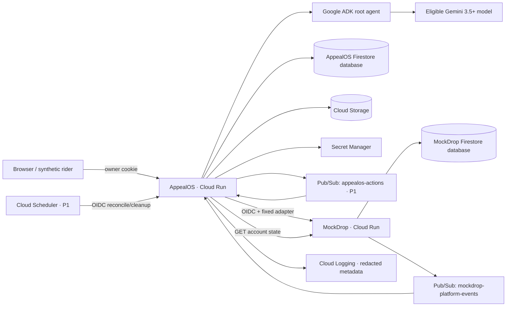

# AppealOS Runtime Technical Design

**Status:** Proposed, approved for implementation

**Version:** 0.1

**Scope:** Synthetic MockDrop hackathon MVP

**Source of product requirements:** [PRD.md](PRD.md)

## 1. Design objective

Build a tool-using Agent that can carry one appeal from a synthetic suspension notice to a directly verified external account state. The architecture must make user authority, model uncertainty, side effects, receipts, and retries explicit.

This document specifies the target architecture and records the current implementation state. A component becomes “implemented” only after its verification passes and the README is updated.

## Implementation status

| Component | Status | Evidence |
|---|---|---|
| MockDrop domain and HTTP API | Implemented locally | `apps/mockdrop/src`; deterministic appeal and account transitions |
| MockDrop idempotency and receipt recovery | Implemented locally | Seven passing HTTP integration tests |
| MockDrop container | Implemented, not deployed | `apps/mockdrop/Dockerfile` |
| MockDrop Firestore persistence | Planned | Current store is in-memory |
| Cloud Run OIDC | Planned | Current write guard is an optional local bearer token |
| Pub/Sub event publication | Planned | Current API returns the proposed outbound event in its response |
| AppealOS ADK runtime and UI | Planned | No `apps/appealos` implementation yet |
| Google Cloud deployment | Planned | No deployed revision yet |

## 2. Architecture decisions

1. **One ADK root agent.** Multi-agent roles add coordination cost without improving the single-case proof.
2. **Firestore is the workflow authority.** ADK sessions help one invocation but never carry the only durable state.
3. **Models interpret; code authorizes.** Gemini proposes structured facts and tools. Deterministic code controls deadlines, permissions, transitions, and writes.
4. **Two deployed origins.** AppealOS and MockDrop run as separate Cloud Run services with separate service identities.
5. **Synthetic fixtures only.** The public build has no production identity, real-user upload, or live-platform adapter.
6. **Hash consistency, not authenticity.** Event hashes expose internal inconsistency under a trusted service boundary; they do not prove an administrator did not rewrite the whole export.
7. **One binding rescue path.** The deployed demo prioritizes the external write, Pub/Sub supplement, replay protection, and direct status verification over general infrastructure.

## 3. System context



## 4. Components

### 4.1 AppealOS Cloud Run service

Proposed implementation: Python FastAPI application containing the Google ADK runtime and serving precompiled React assets.

Responsibilities:

- create/reset the demo owner session;
- expose case read and approval endpoints;
- run the ADK agent and typed tools;
- enforce analysis consent and Appeal Mandate policy;
- persist case transitions, events, actions, and receipts;
- consume authenticated Pub/Sub pushes;
- call only the fixed MockDrop adapter;
- serve the redacted audit export;
- expose health and smoke-test evidence.

### 4.2 MockDrop Cloud Run service

MockDrop is a cooperative simulated external platform, not a real integration or independent adjudicator.

The current local implementation uses Node.js built-in HTTP and an in-memory store. It implements all documented HTTP routes, deterministic approval/rejection, account activation, receipt lookup, and idempotent replay. It returns proposed outbound event payloads to its caller but does not publish Pub/Sub messages yet.

Cloud target responsibilities:

- persist the synthetic rider and appeal in a separate Firestore database;
- accept only authenticated AppealOS service calls;
- deduplicate requests by idempotency key;
- return durable action receipts;
- emit one supplement request through Pub/Sub;
- apply the documented deterministic decision rule;
- expose a direct account-status endpoint and read-only demo console.

### 4.3 Gemini

Proposed responsibilities:

- parse the synthetic notice into a strict schema;
- rank the three artifacts for relevance;
- produce structured claim units;
- map claim units to frozen policy clauses;
- classify the supplement request and decision response.

Gemini cannot:

- mutate the case state;
- compute authoritative deadlines;
- approve a mandate;
- select arbitrary destinations or URLs;
- bypass citation, evidence, or byte limits;
- declare the account active.

### 4.4 Google ADK

ADK defines `appeal_runtime_agent`, typed tools, before-tool authorization callbacks, and after-tool receipt capture. Each invocation reloads case state from Firestore. ADK session memory is never the sole source of a pending action or user permission.

## 5. Trust boundaries

```text
Untrusted                      Trusted application boundary              External simulation
---------------------------    --------------------------------------    -----------------------
notice text                 -> typed parser + schema validator
policy text                 -> quoted context + clause allowlist
evidence content            -> consent + hash/citation checks
model output                -> transition and mandate guards          -> MockDrop typed API
Pub/Sub payload             -> OIDC + binding + replay checks         <- MockDrop publisher
browser request             -> owner-cookie hash check
```

No Agent tool accepts an arbitrary URL, shell command, filesystem path, email address, or recipient.

## 6. Proposed repository structure

```text
apps/
├── appealos/
│   ├── appealos_agent/
│   │   ├── agent.py
│   │   ├── tools.py
│   │   ├── prompts.py
│   │   └── schemas.py
│   ├── api/
│   │   ├── cases.py
│   │   ├── events.py
│   │   ├── internal.py
│   │   └── health.py
│   ├── domain/
│   │   ├── state_machine.py
│   │   ├── mandates.py
│   │   ├── hashing.py
│   │   └── outbox.py
│   ├── web/
│   ├── tests/
│   ├── pyproject.toml
│   └── Dockerfile
└── mockdrop/
    ├── src/
    ├── tests/
    ├── package.json
    └── Dockerfile
fixtures/
├── notice.json
├── policy.json
├── delivery-receipt.json.enc
├── gps-trace.json.enc
└── device-log.json.enc
infra/
├── deploy.sh
└── README.md
```

This is a target layout, not the current repository state.

## 7. Domain model

### 7.1 AppealCase

```ts
type AppealCase = {
  caseId: string;
  ownerId: string;
  ownerTokenHash: string;
  platform: "mockdrop";
  allegationType?: "ABNORMAL_LOCATION";
  state: AppealState;
  deadlineAtUtc?: string;
  deadlineSourceText?: string;
  deadlineSourceTimezone?: string;
  policyProfileId?: string;
  activeMandateId?: string;
  latestPlatformReceiptId?: string;
  expectedPlatformState: "SUSPENDED" | "ACTIVE";
  verificationAttempts: number;
  maxVerificationAttempts: 3;
  version: number;
  expiresAt: string;
  createdAt: string;
  updatedAt: string;
};
```

Parsed fields remain optional in `NOTICE_RECEIVED` and `NEEDS_USER_REVIEW`. They are required before entering `PARSED`.

### 7.2 EvidenceArtifact

```ts
type EvidenceArtifact = {
  artifactId: string;
  caseId: string;
  kind: "DELIVERY_RECEIPT" | "GPS_TRACE" | "DEVICE_LOG";
  capturedAt: string;
  storageUri: string;
  plaintextSha256: string;
  ciphertextSha256: string;
  mimeType: string;
  aesGcmNonceB64: string;
  aadCanonical: string;
  demoKeyVersion: string;
  source: "DEMO_FIXTURE";
};
```

### 7.3 AnalysisConsent

```ts
type AnalysisConsent = {
  consentId: string;
  schemaVersion: "1.0";
  caseId: string;
  ownerId: string;
  artifactIds: string[];
  purposes: Array<"TIMELINE" | "POLICY_MATCH" | "DRAFT_CLAIMS">;
  allowGeminiProcessing: true;
  approvedAt: string;
  expiresAt: string;
  revokedAt?: string;
};
```

### 7.4 GroundedClaim

```ts
type GroundedClaim = {
  claimId: string;
  claimType: "OBSERVED_EVENT" | "CAUSAL_EXPLANATION" | "POLICY_REQUEST";
  text: string;
  evidence: Array<{
    artifactId: string;
    plaintextSha256: string;
    exactSpan: string;
  }>;
  policyClauseIds: string[];
  confidence: number;
  validator: "CITATION_VALID" | "NEEDS_USER_REVIEW" | "REJECTED";
};
```

Code validates the existence and integrity of citations. It does not prove semantic entailment. All causal claims and low-confidence claims require user approval.

### 7.5 AppealMandate

```ts
type AppealMandate = {
  mandateId: string;
  schemaVersion: "1.0";
  caseId: string;
  ownerId: string;
  destinationAdapter: "mockdrop";
  destinationAccountId: string;
  approvedClaimIds: string[];
  allowedActions: Array<"SUBMIT" | "SUPPLEMENT" | "POLL" | "VERIFY">;
  approvedArtifactIds: string[];
  approvedEvidenceRules: Array<{
    kind: "DELIVERY_RECEIPT" | "GPS_TRACE" | "DEVICE_LOG";
    allowedFields: string[];
    fromUtc: string;
    toUtc: string;
    maxBytes: number;
    redactionProfile: "DEMO_MINIMUM";
  }>;
  allowedSupplementTemplate: "DEVICE_NETWORK_HANDOFF_V1";
  maxSupplementCycles: 1;
  supplementCyclesUsed: number;
  stopConditions: Array<
    "NEW_ALLEGATION" | "NEW_RECIPIENT" | "NEW_EVIDENCE_CLASS" | "MANDATE_EXPIRED"
  >;
  approvedAt: string;
  expiresAt: string;
  mandateDigest: string;
  approvalSessionId: string;
  revokedAt?: string;
};
```

### 7.6 Event, action, and receipt

```ts
type CaseEvent = {
  eventId: string;
  caseId: string;
  caseVersion: number;
  sequence: number;
  type: string;
  actor: "USER" | "AGENT" | "PLATFORM" | "SYSTEM";
  causationId?: string;
  correlationId: string;
  artifactRefs: string[];
  receiptRef?: string;
  previousEventHash: string;
  eventHash: string;
  createdAt: string;
};

type ActionOutbox = {
  actionId: string;
  caseId: string;
  actionCaseVersion: number;
  actionType: "SUBMIT_APPEAL" | "SUBMIT_SUPPLEMENT" | "POLL" | "VERIFY";
  idempotencyKey: string;
  mandateId: string;
  status: "PENDING" | "LEASED" | "SUCCEEDED" | "FAILED";
  leaseUntil?: string;
  authorizationLeaseUntil?: string;
  attempts: number;
};

type PlatformReceipt = {
  receiptId: string;
  adapter: "mockdrop";
  actionId: string;
  idempotencyKey: string;
  requestHash: string;
  responseStatus: number;
  responseHash: string;
  platformState?: string;
  receivedAt: string;
};
```

## 8. State machine

Business transitions increment `case.version`. Operational events such as `DISPATCHING`, lease renewal, and retry diagnostics increment only `CaseEvent.sequence`.

| Source | Event | Guard | Destination |
|---|---|---|---|
| `NOTICE_RECEIVED` | `PARSE_SUCCEEDED` | Required parsed fields are unambiguous | `PARSED` |
| `NOTICE_RECEIVED` | `PARSE_UNCERTAIN` | Missing or conflicting fields | `NEEDS_USER_REVIEW` |
| `NEEDS_USER_REVIEW` | `USER_CONFIRMED_PARSE` | State-specific schema passes | `PARSED` |
| `PARSED` | `EVIDENCE_COMPILED` | Consent active and three hashes verified | `DRAFT_READY` |
| `DRAFT_READY` | `MANDATE_APPROVED` | Claims approved and deadline open | `SUBMISSION_PENDING` |
| `SUBMISSION_PENDING` | `PLATFORM_RECEIPT_STORED` | Accepted receipt binds action and request hash | `ACKNOWLEDGED` |
| `ACKNOWLEDGED` | `SUPPLEMENT_REQUESTED` | New bound external event | `SUPPLEMENT_REQUESTED` |
| `ACKNOWLEDGED` | `DECISION_APPROVED` | Decision receipt stored | `DECIDED_APPROVED` |
| `ACKNOWLEDGED` | `DECISION_REJECTED` | Decision receipt stored | `DECIDED_REJECTED` |
| `SUPPLEMENT_REQUESTED` | `AUTO_SUPPLEMENT_ALLOWED` | All mandate constraints pass | `SUPPLEMENT_PENDING` |
| `SUPPLEMENT_REQUESTED` | `AUTO_SUPPLEMENT_BLOCKED` | Any mandate guard fails | `NEEDS_USER_APPROVAL` |
| `NEEDS_USER_APPROVAL` | `MANDATE_REISSUED` | Specific new scope approved | `SUPPLEMENT_PENDING` |
| `SUPPLEMENT_PENDING` | `SUPPLEMENT_RECEIPT_STORED` | Receipt binds action and request hash | `SUPPLEMENTED` |
| `SUPPLEMENTED` | `DECISION_APPROVED` | Decision receipt stored | `DECIDED_APPROVED` |
| `SUPPLEMENTED` | `DECISION_REJECTED` | Decision receipt stored | `DECIDED_REJECTED` |
| `DECIDED_APPROVED` | `ACCOUNT_STATUS_ACTIVE` | Direct response is active | `ACCOUNT_ACTIVE` |
| `DECIDED_APPROVED` | `ACCOUNT_STATUS_SUSPENDED` | Attempts remain | `VERIFICATION_RETRY` |
| `VERIFICATION_RETRY` | `ACCOUNT_STATUS_ACTIVE` | Direct response is active | `ACCOUNT_ACTIVE` |
| `VERIFICATION_RETRY` | `ACCOUNT_STATUS_SUSPENDED` | Attempt count reaches three | `ACTION_FAILED_TERMINAL` |
| `DECIDED_REJECTED` | `EXPORT_CREATED` | Export generation succeeds | `ESCALATION_PACKET_READY` |
| Any pre-submission state | `DEADLINE_PASSED` | UTC cutoff is reached | `DEADLINE_EXPIRED` |
| Any mandate-scoped state | `MANDATE_EXPIRED_OR_REVOKED` | Action has not entered dispatch | `MANDATE_EXPIRED` |
| `MANDATE_EXPIRED` | `MANDATE_REISSUED` | Current scope and deadline pass | Prior action state |
| Any write-pending state | `RETRYABLE_FAILURE` | Retry budget remains | `ACTION_FAILED_RETRYABLE` |
| `ACTION_FAILED_RETRYABLE` | `RETRY_SCHEDULED` | Lease expired; version unchanged | Prior write-pending state |
| Any state | `TERMINAL_FAILURE` | Non-retryable adapter or integrity failure | `ACTION_FAILED_TERMINAL` |

The implementation should model “prior state” explicitly as `resumeState`; it must not infer it from log order.

## 9. Deadline and mandate semantics

- Preserve the original deadline text and timezone.
- Normalize only an unambiguous result to UTC.
- Treat the cutoff as exclusive: `now < deadlineAtUtc` permits a new action.
- A missing or conflicting deadline pauses for user review.
- Polling and verification may continue after the appeal deadline if the case was submitted in time.
- An expired mandate blocks new writes, polls, and verifications.
- Authenticated inbound events may still be persisted after mandate expiry.
- Revocation blocks actions before `DISPATCHING`; an in-flight or accepted remote request cannot be recalled.

## 10. ADK tool surface

| Tool | Side effect | Required guard |
|---|---|---|
| `parse_notice` | None | Packaged synthetic notice only |
| `query_vault_metadata` | None | Valid owner session |
| `read_artifact_for_analysis` | Internal read | Valid owner and unexpired Analysis Consent |
| `read_approved_artifact` | External-payload read | Active mandate and exact evidence rule match |
| `lookup_policy_profile` | None | Frozen allowlisted profile |
| `compile_appeal` | Creates draft | Citation-integrity and confidence rules pass |
| `submit_appeal` | MockDrop write | Active mandate, deadline, adapter allowlist, idempotency key |
| `submit_supplement` | MockDrop write | Active mandate, template, artifact constraints, cycle limit |
| `poll_case_status` | MockDrop read | Active mandate and rate limit |
| `verify_account_state` | MockDrop read | Active mandate and verification budget |
| `export_due_process_audit` | Creates JSON artifact | Valid owner and fixed redaction profile |

## 11. MockDrop adapter contract

All write/read endpoints require a Google-signed identity token with MockDrop as the audience, except the read-only demo console.

| Method | Path | Purpose |
|---|---|---|
| `POST` | `/v1/demo/reset` | Server-side reset; demo-admin credential only |
| `GET` | `/v1/accounts/{accountId}` | Direct state verification |
| `POST` | `/v1/appeals` | Initial appeal submission |
| `GET` | `/v1/actions/by-idempotency/{key}` | Receipt recovery after uncertain write |
| `POST` | `/v1/appeals/{appealId}/supplements` | Authorized supplement submission |
| `GET` | `/v1/appeals/{appealId}` | Decision read |

### Idempotency behavior

- The client creates and stores the idempotency key with the action.
- The same key and identical request hash return the original receipt.
- The same key and different request hash return HTTP `409`.
- A retry never computes a new key.

### Deterministic decision rule

1. A valid initial appeal is accepted and produces one supplement request.
2. The accepted response creates ordered `APPEAL_SUBMITTED` and `PLATFORM_ACKNOWLEDGED` events in AppealOS.
3. A supplement containing the expected synthetic device-log hash, permitted fields, and `DEVICE_NETWORK_HANDOFF_V1` template changes the appeal to `APPROVED` and the account to `ACTIVE`.
4. Any other supplement changes the appeal to `REJECTED`.

Every MockDrop response includes receipt ID, request hash, platform sequence, and timestamp.

## 12. Pub/Sub and background processing

### Topics

| Topic | Publisher | Consumer | Scope |
|---|---|---|---|
| `mockdrop-platform-events` | MockDrop service account only | AppealOS push endpoint | P0 supplement and decision events |
| `appealos-actions` | AppealOS service account only | AppealOS worker endpoint | P1 durable action dispatch |

Messages use an ordering key equal to `appealId`. Each platform event includes external event ID, account ID, case ID, platform sequence, event time, and body hash.

The consumer:

1. validates Pub/Sub OIDC issuer, audience, service account, and message age;
2. verifies case/account binding and body hash;
3. exits on an already processed external event ID;
4. stores a future platform sequence as `BUFFERED`;
5. consumes buffered events after missing predecessors arrive;
6. invokes a stateless ADK run reconstructed from Firestore.

### P1 action outbox

1. A Firestore transaction creates the case transition, event, and action with immutable `actionCaseVersion` and `idempotencyKey`.
2. The API publishes `actionId` after commit.
3. Cloud Scheduler calls an OIDC-protected reconciler once per minute.
4. The reconciler republishes old pending actions and actions with expired leases.
5. A worker transaction acquires the action lease only when case version and status match.
6. The worker validates the mandate, prepares the request, revalidates immediately before dispatch, appends `DISPATCHING`, and starts the HTTP request.
7. If the worker crashes after acceptance, receipt lookup by idempotency key resolves uncertainty.

The P0 rescue build can call MockDrop directly for the initial write and use Pub/Sub only for the supplement path. Documentation must not claim the P1 outbox is implemented until its crash test passes.

## 13. Hashing and exports

Use RFC 8785 JSON Canonicalization Scheme and SHA-256.

```text
eventHash = SHA256(JCS(event without eventHash))
mandateDigest = SHA256(JCS(mandate without mandateDigest,
                              approvedAt, revokedAt, supplementCyclesUsed))
requestHash = SHA256(method + "\n" + path + "\n" + JCS(body))
eventChainRoot = final eventHash, or 64 zeroes for an empty chain
```

The genesis `previousEventHash` is 64 zeroes. JavaScript and Python must share a fixed canonical test vector and expected hashes.

`DueProcessAuditExportV1` contains:

- case and allegation identifiers;
- policy profile ID, version, source URL/hash, and capture time;
- redacted artifact IDs, kinds, hashes, and capture times;
- grounded claims and citations;
- mandate digest and allowed scope;
- events and redacted platform receipts;
- final case state and chain root.

It excludes owner tokens, encryption keys, raw evidence, coordinates, full device IDs, full prompts, and secrets. The export proves internal hash consistency only. It is not signed, externally anchored, immutable, or independently authentic.

## 14. Evidence encryption

The public MVP uses fixed synthetic fixtures.

1. A seed script calculates the plaintext SHA-256.
2. It generates a unique random 96-bit nonce per artifact.
3. It encrypts with AES-256-GCM.
4. AAD is canonical `{schemaVersion, caseId, artifactId, plaintextSha256}`.
5. Cloud Storage receives nonce, AAD, ciphertext, and authentication tag.
6. Secret Manager stores the demo AES key.
7. AppealOS decrypts the minimum allowed fixture in memory after permission checks and releases references on a best-effort basis.

Managed Python does not guarantee secure memory erasure. The server can decrypt fixtures. The UI must not describe this as zero-knowledge or exclusively user-held custody.

## 15. Authentication and service identity

### Browser demo owner

- `POST /demo/reset` creates a random 256-bit owner token.
- Firestore stores only its hash.
- The browser receives a `Secure`, `HttpOnly`, `SameSite=Strict` cookie.
- Every case API validates the cookie hash.
- Browsers have no direct Firestore or Storage access.

### Service-to-service

- AppealOS uses its Cloud Run identity to call MockDrop.
- MockDrop alone can publish `mockdrop-platform-events`.
- AppealOS alone can publish `appealos-actions`.
- Pub/Sub uses a dedicated push identity allowed to invoke only event routes.
- Scheduler uses a separate OIDC identity allowed to invoke only reconcile and cleanup routes.
- The demo-admin credential stays on the AppealOS server and never reaches the browser.

## 16. Prompt and tool security

- Quote notices, policies, responses, and evidence as untrusted content.
- Require structured Gemini output and reject unknown fields.
- Keep destination, method, path, MIME type, field names, and payload size on closed allowlists.
- Run permission code before each read and side effect, not only in prompts.
- Never include secrets, tokens, complete evidence, or unrelated personal data in a model request.
- Log hashes, IDs, statuses, model/run IDs, and latency; never raw evidence or full receipts.
- Quarantine hash mismatches and stop the case.
- Treat a model request for an unavailable tool as an error, not an instruction to improvise.

## 17. Retention and reset

- `AppealCase.expiresAt` is a Firestore TTL field.
- Cloud Storage uses a one-day lifecycle rule.
- TTL and lifecycle deletion are asynchronous and do not delete Firestore subcollections at an exact time.
- `POST /demo/reset` coordinates immediate best-effort cleanup of the current AppealOS case and a server-to-server MockDrop reset.
- The P1 Scheduler cleanup removes case subcollections, outbox records, buffered events, and exports idempotently.
- If P1 cleanup is deferred, README and Devpost must say so.

## 18. Observability

Every request and event should carry `caseId`, `correlationId`, `actionId`, and ADK run ID where applicable.

Structured logs may include:

- state transition and case version;
- tool name and result category;
- receipt ID and hashes;
- Pub/Sub message/external event IDs;
- retry count and lease timestamps;
- model ID, region, latency, and token counts;
- redaction and permission decision codes.

Structured logs must not include raw evidence, owner tokens, keys, full prompts, full appeals, or unredacted receipts.

## 19. Deployment

### Build gates

1. Verify access to a competition-eligible Gemini 3.5+ model.
2. Record exact model ID, endpoint, region, and ADK version.
3. Run one structured-output and typed-tool smoke test.
4. Block deployment if the runtime would fall back to an ineligible model.

### Proposed Cloud Run services

- `appealos`: FastAPI, ADK, and compiled UI.
- `mockdrop`: simulated platform and read-only console.

Both services use separate identities and deployed origins. MockDrop persists to a separate Firestore database so AppealOS cannot claim success by editing MockDrop state directly.

## 20. Test plan

### P0 tests

- happy path from reset to directly verified `ACTIVE`;
- Gemini schema rejection for unknown or missing fields;
- prompt injection inside notice and policy fixtures;
- artifact hash mismatch;
- citation references a nonexistent artifact or span;
- causal claim requires user approval;
- expired or revoked analysis consent;
- expired or revoked mandate before dispatch;
- supplement outside evidence or template scope;
- duplicate Pub/Sub supplement delivery;
- same idempotency key with different request body returns `409`;
- approval decision while account remains suspended;
- verification retry exhaustion;
- audit export excludes raw evidence and secrets;
- structured logs pass secret/evidence redaction checks.

### P1 tests

- crash before Pub/Sub action publish;
- crash with an expired worker lease;
- crash after MockDrop accepted the write but before local receipt persistence;
- future platform sequence buffering;
- scheduled cleanup of subcollections and orphaned artifacts;
- cross-language canonical hash vector.

## 21. Delivery plan

### Binding rescue implementation

1. Build and manually verify MockDrop's deterministic API.
2. Verify eligible Gemini and ADK tool invocation.
3. Implement case schemas, P0 transitions, permissions, and static fixtures.
4. Implement initial authenticated write and durable receipt.
5. Connect the one Pub/Sub supplement event and replay protection.
6. Implement direct account-state verification.
7. Build only the approved case page and MockDrop console.
8. Deploy both services and record the four-minute path.

### Full 48-hour continuation

1. Add the action outbox, leases, and Scheduler reconciler.
2. Add buffered event sequencing and crash recovery tests.
3. Add scheduled retention cleanup.
4. Add the complete JSON audit verifier.
5. Add rejected-case export and human-escalation preparation.

## 22. Known limitations

- The outcome rule is deterministic and cooperative.
- MockDrop proves external state mutation in a simulation, not a live-platform appeal.
- The server can decrypt the synthetic Vault.
- Event hashes provide internal consistency, not independent authenticity.
- The demo owner cookie is not production identity or tenant isolation.
- Real policy interpretation, platform terms, sensitive-data handling, and legal boundaries require specialist review.
- Platform adapters without durable idempotency cannot promise exactly-once remote behavior.

## 23. Deferred architecture decisions

- production identity and organization tenancy;
- regional data residency and user-controlled retention;
- real email or notice ingestion;
- per-case envelope encryption or user-held keys;
- signed or externally anchored audit exports;
- a real platform adapter and lawful submission route;
- worker-center or legal-aid organization workflows;
- an open Appeal Case protocol and adapter SDK.
